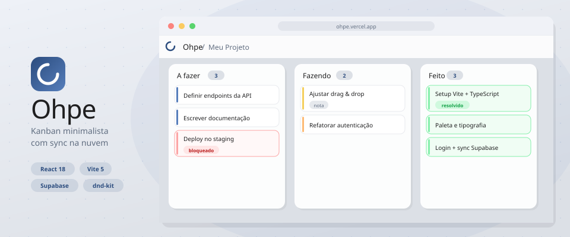

<div align="center">



<br />

<h1>
  
  Ohpe
</h1>

<p>
  <a href="https://github.com/DenverCoder1/readme-typing-svg">
    
  </a>
</p>

<p>
  
  
  
  
  
</p>

</div>

---

## Por que existe

Um kanban de bolso, feito pra abrir num aba e usar. **Sem login, sem servidor, sem tracker.** Tudo vive no `localStorage` do navegador — o único jeito de tirar os dados de lá é você mesmo baixando o JSON pelo botão de download.

## O que tem

|  | |
|---|---|
| **Colunas editáveis** | Clique no título pra renomear, remova quando quiser, arraste pra reordenar cards |
| **Cards rápidos** | Um tile `+` no rodapé da coluna vira input; Enter cria, Esc cancela |
| **Editar in place** | Passe o mouse no card e use o lápis pra ajustar o título |
| **Drag & drop real** | `@dnd-kit` com sortable — arraste entre e dentro de colunas |
| **Persistência local** | `localStorage`, salva a cada mudança |
| **Exportar JSON** | Ícone no header baixa `ohpe-board-YYYY-MM-DD.json` |
| **Design coerente** | Paleta azul + IBM Plex Sans / Sora, dark navy em acento |

## Stack

<p>
  
</p>

- **React 18** + **TypeScript 5** — UI declarativa e tipada
- **Vite 5** — dev server rápido e build estático
- **@dnd-kit** (`core` + `sortable`) — drag & drop acessível
- **CSS puro** com tokens custom (`--color1..5`) — sem framework de estilo

## Como rodar

```bash
git clone <este-repo>
cd Ohpe
npm install
npm run dev            # http://localhost:5173
```

Para produção:

```bash
npm run build          # gera dist/
npm run preview        # serve dist/ localmente
```

Como o app é 100% estático, publique a pasta `dist/` em qualquer host — **Vercel, Netlify, GitHub Pages, Cloudflare Pages** — arrasta e solta.

## Estrutura

```
src/
├── App.tsx
├── main.tsx
├── components/       # Card, Column, NewCardForm
├── pages/            # BoardPage
├── hooks/            # useBoard (localStorage)
├── types/            # tipagem do board
├── utils/            # downloadJson
└── styles/           # globals.css, board.css
```

## Atalhos

| Ação | Como |
|---|---|
| Criar card | Clique no `+` → digite → **Enter** |
| Cancelar criação | **Esc** |
| Editar card | Hover no card → ícone de **lápis** |
| Renomear coluna | Clique no título da coluna |
| Nova linha no card | **Shift + Enter** durante edição |
| Remover coluna | `×` ao lado do título (confirma se tiver cards) |
| Baixar board | Ícone de download no canto superior direito |

## Paleta

| Token | Hex | Uso |
|---|---|---|
| `--color1` | `#1f1f20` | Texto principal |
| `--color2` | `#2b4c7e` | Acento primário, borda de foco |
| `--color3` | `#567ebb` | Hover, gradiente da marca |
| `--color4` | `#606d80` | Texto secundário, ícones |
| `--color5` | `#dce0e6` | Fundo, chips |

## Roadmap

- [ ] Temas claro/escuro sincronizados com o SO
- [ ] Import de JSON (o oposto do download)
- [ ] Múltiplos boards com abas
- [ ] Atalhos de teclado globais
- [ ] Undo/redo

## Licença

MIT © Enzo

<div align="center">
  <sub>Feito com <code>◇</code> e um pouco de café.</sub>
</div>
